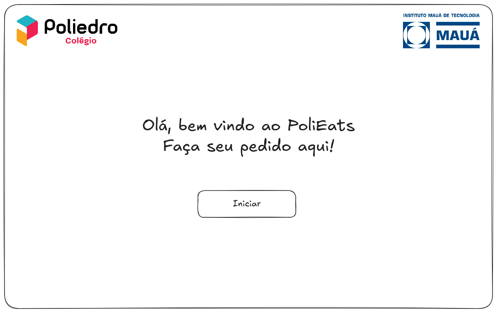

# Requisitos:

## Telas:
- Tela de boas vindas:
  - A tela de boas vindas deve conter a logo do Poliedro, a logo da Mauá, uma breve introdução para o cliente e um botão abaixo para redirecionar o usuário para a tela de chat("Olá, boas vindas ao PoliEats, faça seu pedido aqui! <Botão>").
- Tela do chat:
  - A tela do chat deve conter uma barra lateral vertical com a logo do sistema no topo, um botão de sair e um botão de ajuda na região inferior da tela, ao lado dessa barra vertical, deve existir um container onde irão aparecer as mensagens do bot e do usuário, assim como uma barra de input para a mensagem do usuário.

_(Protótipo de tela de boas vindas)_

_(Protótipo de tela chat)_
